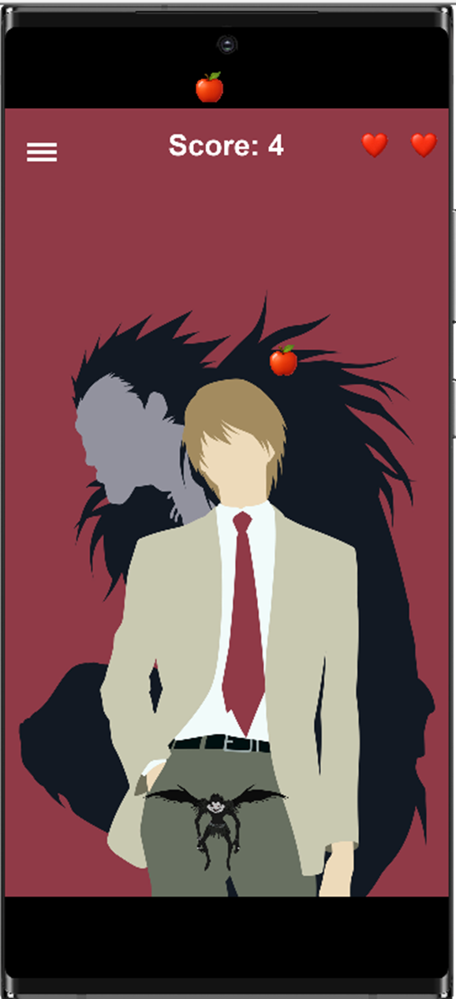
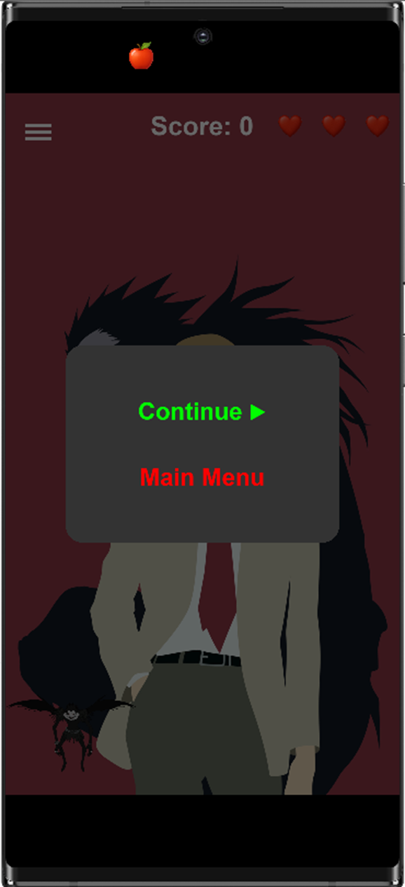

**🍎 Bucket Collect Apples -- Solar2D Mobile Game**

**Bucket Collect Apples** is a smooth, arcade-style mobile game built
using **Solar2D**, a powerful 2D game engine that uses **Lua** for
scripting. The player controls a bucket to catch falling apples. The
game features a lives system, high score tracking, and a responsive
design optimized for mobile screens.

This game was designed as a simple yet polished example of casual mobile
gameplay, with clean structure, smooth performance, and extensible
features.

BucketCollectApples/

├── main.lua \# Entry point that launches the menu scene

├── config.lua \# Virtual screen size, scaling mode, and FPS settings

├── build.settings \# App-level settings: permissions, orientation, etc.

├── menu.lua \# Menu scene showing high score and Play button

├── game.lua \# Main gameplay loop with collision, physics, UI, and
pause system

├── apple.png \# Falling object asset (apple)

├── bucket.png \# Player-controlled bucket asset

├── heart.png \# Life indicator image (3 hearts shown at top)

├── background.png \# (Optional) background image behind game screen

├── README.md \# Project documentation (this file)

🧰 Tools and Libraries Used

  -----------------------------------------------------------------------
  **Tool / Tech**    **Description**
  ------------------ ----------------------------------------------------
  **Solar2D (Corona  Open-source 2D game engine focused on mobile
  SDK)**             performance

  **Lua**            Lightweight scripting language used for all game
                     logic

  **Corona           Desktop runtime used to preview and test game on
  Simulator**        local system

  **ImageGen AI**    Used to generate visual assets like the apple and
                     heart as PNGs

  **Composer         Scene management library built into Solar2D for
  Library**          handling game flow
  -----------------------------------------------------------------------

🔤 Language Used: **Lua**

The entire game was coded in **Lua**, a fast and lightweight scripting
language. Lua is popular in game development because:

- It's easy to learn and write

- Very performant even on low-end devices

- Supports modular, event-driven design

**In this game**, Lua was used for:

- Setting up scenes (menu.lua, game.lua)

- Physics-based interactions (game.lua)

- UI elements (score, hearts, game over text)

- Touch input for bucket movement

- Collision detection and timers

✨ Game Features Explained

**🪣 Bucket Control**

- Players move the bucket using touch input (left/right).

- Movement is clamped to screen bounds so the bucket doesn't go
  off-screen.

**🍎 Falling Apples**

- Apples spawn at the top every second and fall downward using physics.

- If an apple is caught, it increments the score.

- If an apple reaches the bottom without being caught, the player loses
  a life.

**❤️ Life System**

- Player starts with 3 lives, shown as heart icons.

- Each missed apple removes one heart.

- When all 3 lives are lost, the game displays "Game Over" and returns
  to the main menu after a short delay.

**☠️ Game Over Logic**

- Triggered when lives == 0

- Game physics pauses, and a "Game Over" message is displayed

- After 2 seconds, the game transitions back to the menu

**🥇 High Score Tracking**

- The highest score achieved during the session is stored in a global
  setting

- Displayed on the menu screen

- Automatically updates if the current score beats the previous best

**☰ Pause Menu**

- Tap the ☰ hamburger icon to pause

- Options:

  - \"Continue\" resumes the game

  - \"Main Menu\" returns to the menu

🚀 Future Improvements

  -----------------------------------------------------------------------
  **Feature**              **Description**
  ------------------------ ----------------------------------------------
  🔊 **Sound Effects**     Play catch/miss/game over sounds for feedback

  🍌 **Variety of Fruits** Add banana, grapes, etc. for visual variation

  🎮 **Difficulty          Apples fall faster as score increases
  Scaling**                

  💡 **Animated Bucket**   Animate bucket when apple is caught

  🎯 **Game Over Screen**  Show final score and a \"Replay\" button

  🥇 **Online              Submit and view global high scores
  Leaderboard**            
  -----------------------------------------------------------------------

**🔐 License**

This project is released under the **MIT License**, allowing you to:

- Use it for personal or commercial projects

- Modify the source code freely

- Share it with others

- Attribution is appreciated but not required

**MIT License**

**Copyright (c) 2025 YOUR_NAME**

**Permission is hereby granted, free of charge, to any person obtaining
a copy\...**

**🌐 GitHub Repository**

To host this project on GitHub:

1.  Create a repo: bucket-collect-apples

2.  Push your project folder

3.  Add this README.md and commit

🔗 **Repo URL**:\
https://github.com/vinitpanchaal/Bucket-Game

💡 Getting Started (Base Setup)

To run the game locally:

1.  [Install Solar2D](https://solar2d.com/)

2.  Open the project folder in **Corona Simulator**

3.  Run main.lua

4.  Build for Android/iOS via File \> Build menu

Assets taken from several trusted sites (apple, heart, bucket)

Game built as a mobile arcade showcase using open tools

**📱 Play, Catch, Win!**

Move fast, catch the apples, and keep your lives alive.\
Try to beat your high score every time. 🚀

📷Screenshots

Home Screen

Game Screen

Pause Screen

